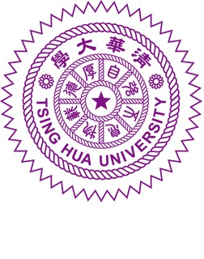
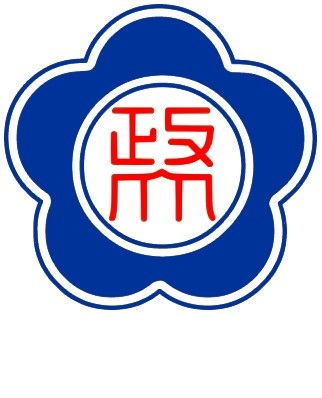
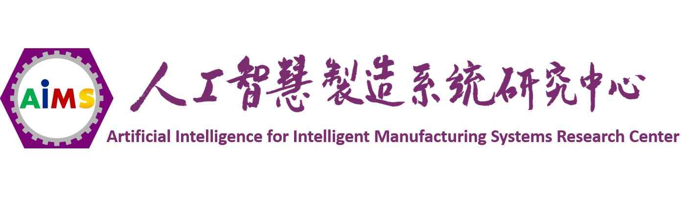
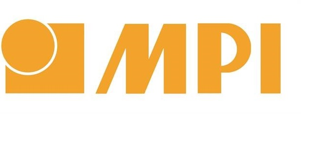

-------------------     ----------------------------

<b>{width=20px} Email : jim71183@gmail.com　　{width=20px} Phone : +886-910015233　　{width=20px} Location : Hsinchu, Taiwan</b>

  

***

## **Education**

2016 - 2018
:   **M.S. Degree : Industrial Engineering and Engineering Management ; National Tsing Hua University, Hsinchu, Taiwan**<a href="https://nthu-en.web.nthu.edu.tw/bin/home.php">{width=40px}</a>

    *Thesis title : Apply Intelligent Agent in Manufacturing Parameter Optimization and Empirical Study-Cases Study of Precision Forming and IC Packaging Process*

Tutor Assistant Experience

 -  Decision Analysis, 1 semester
 -  Data Mining, 1 semester

2012 - 2016
:   **B.S. Degree : Statistics ; National Cheng Chi University, Taipei, Taiwan** <a href="https://www.nccu.edu.tw/?locale=en">{width=40px}</a>

***

## **Experience**

2018/07 - Present　{width=180px}
: **Artificial Intelligence for Intelligent Manufacturing Systems Research Center, Hsinchu, Taiwan : ** *Algorithm Development Engineer* 

 - Data  collection,  analysis,  report
 - System  development
 - Client development
 - Cooperate  with  customers  to  solve  problems  by  using  data  analysis
 - Analysis consultant

2017/07 - 2017/08　{width=40px}
: **Advanced Semiconductor Engineering, Taoyuan, Taiwan : ** *Intern*　　
 
 - Data  collection,  analysis,  report
 - Domain  knowledge  learning
 
2016/07 - 2016/10　{width=60px}
: **MPI Corporation, Hsinchu, Taiwan : ** *Intern* 　
 
 - Data  collection,  analysis,  report
 - Domain  knowledge  learning

***

## **Skills**
**Programing Language :**

* R　　　 {width=30px}
* Python　{width=30px}
* C++　 　{width=30px}
* SQL 　　{width=30px}

**Other Software**

* Google Cloud Platform {width=30px}
* Linux　{width=30px}

***

## **Industry-University Cooperative Research Project**

* 2019/05-2019/05
: *Consultant*
  `Advisor for data analysis and procedure improvement.`

* 2018/11-2019/05
: *Fault Detection for Dyeing Process*
  `Using machine learning techniques (Microsoft lgbm model) and explainable AI (LIME) to find key features of causing dyeing process failed.`

* 2018/07-2019/06
: *Optimization of Cutting Parameters for NC Machining*
  `Using machine learning techniques (Microsoft lgbm model) and optimization algorithm (GA) to find optimal setting of cutting parameters`

* 2017/06-2017/10
: *Module  for  Advanced  Monitoring  the  Difference  among  IC  Package  Machines	*
  `Using machine learning techniques (PLSR model) and optimization algorithm (GA) to find optimal setting of cutting parameters`

* 2016/06-2018/06
: *Big  Data  Analytics  for  Precision  Molding  Process*
  `Using machine learning techniques (PLSR model) and optimization algorithm (GA) to find optimal setting of cutting parameters`
  `Using convolutional neural network (InceptionResNetv2) classify precision forming product`
  `Using convolutional neural network classify precision forming process signal`

***

## **Academic Achievement & Competition Experience**

* 2018  National  Smart  Manufacturing  and  Big  Data  Analysis  Competition
**Start  up  group : Rank  2**
* 2018  Thesis  Competition  of  College  of  Engineering  of  National  Tsing-Hua  University  -  Apply  Intelligent  Agent  in  Manufacturing  Parameter  Optimization  and  Empirical  Study-Cases  Study  of  Precision  Forming  and  IC  Packaging  Process **Honorable  mention**
* The  20th  Decision  Analysis  Conference  -  Analytic  Hierarchy  Process  of  Multi-  Attribute  Comparison  of  Telecommunication  Companies  in  Taiwan	**Best  paper  award**
* 2018  Informs  Hackathon  –  Develop  smart  healthcare  app  with  computer  vision

***

## **Certification and Training**

* TOEIC **875**
* Big Data Analysis - Using SparkR, Institute for Information Industry
* Web Application design using R and Shiny, Institute for Information Industry

***
## **Other  Experience  **

* Ministry  of  Science  and  Technology  AI  Center  Project  Launch  Meeting  -  Assisting  in  event  planning  and  planning	**2018/03**
* The  20th  Decision  Analysis  Conference  -  Assisting  in  event  planning  and  preparation	**2017/01**
* 2016  International  Symposium  on  Semiconductor  Manufacturing  Intelligence  (ISMI2016)  -  Assisting  in  event  planning  and  preparation	**2016/08**
* Student  Association  of  statistics  Department  of  national  Cheng-Chi  university  -  Sport  Officer　**2015/02-2015/06**
* The  2nd  Statistic  Camp  of  National  Chengchi  University  -  Event  Planning **2013/06-2013/07**
* Team leader of volley ball team of Department of Statistics of National Cheng Chi  University **2013/06-2015/02**

***

## **Side Project**

 - Object detection for rice classification - construct with LEGO brick : [GitHub](https://github.com/ChiHangChen/Object_Detection_Rice)
 - Web chatting room hide behind Stackoverflow interface : *[shinyapps.io](https://chihangchen.shinyapps.io/ShinyChat/)*
 - R  language  package  :  [KeyboardSimulator](https://cran.r-project.org/web/packages/KeyboardSimulator/index.html)

 - R  language  package  :  [SRTtools](https://cran.r-project.org/web/packages/SRTtools/index.html)

 - Using  computer  vision  play  mobile  game  automatically. *[GitHub](https://github.com/ChiHangChen/MapleStoryM-AutoQuest)*
 - Minitab  RSM  analysis  module  development  using  R  language. *[shinyapps.io](https://chihangchen.shinyapps.io/Minitab-RSM-in-R/)*
 - Gomoku  AI  :  Using  PTT  chess  playbook  and  deep  learning  develop  Gomoku  AI. *[shinyapps.io](https://chihangchen.shinyapps.io/FiveInRow_AI/)*
 - Generate company name card with python and R. *[private server](http://chihangdalab.nctu.me:10002/namecard_maker/)*
 - Using R language and shiny package develop web movie theater. *[shinyapps.io](https://chihangchen.shinyapps.io/MovieTheater/)*

***

Last update time : 2019/07/01
